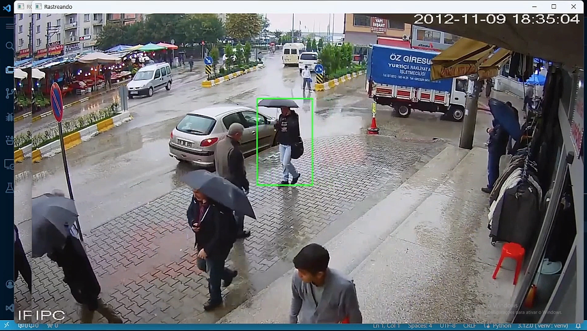

# Rastreamento de Objetos

Estudo de caso onde foi abordado técnicas de rastreamento de objetos utilizando a biblioteca OpenCV. O rastremanto de objetos pode ser utilizado para diversos fins e aplicações.

